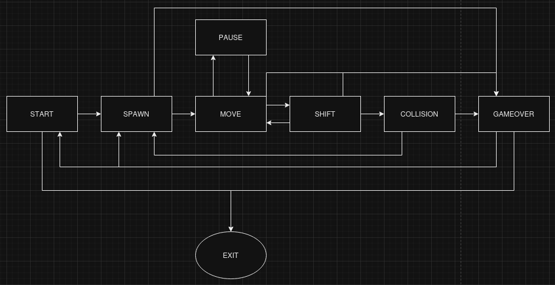
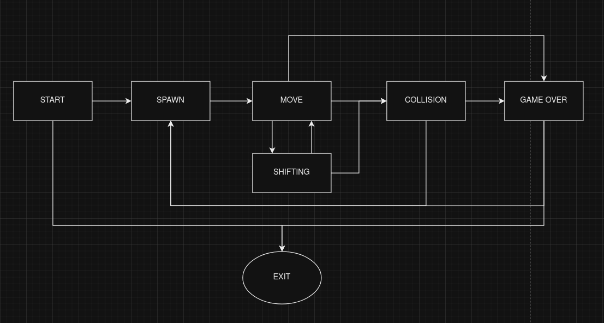

# Brick Game

The project consists of two distinct games, Tetris and Snake, developed for both CLI (Command-Line Interface) and Desktop environments. The Tetris game was implemented in C, while the Snake game was implemented in C++. The CLI interface utilized the ncurses library, while the Desktop interface leveraged the Qt GUI library.

Main targets in the Makefile:

**all**: The default target that builds the project by running `install` and `gcov_report`.

**install**: Builds the project for the CLI and Desktop interfaces.

**install_ui_cli**: Compiles and creates the main game executable for the CLI interface.

**run_cli**: Runs the compiled game executable for the CLI interface.

**install_ui_qt**: Builds the UI with Qt using CMake.

**run_desktop**: Runs the compiled game executable for the Desktop interface.

**uninstall**: Removes all build artifacts and clears the project directory.

**rebuild**: Rebuilds the project, removing and reinstalling the project.

**test**: Runs tests using CTest and Google Test.

**ctest**: Compiles and runs tests using CTest.

**gtest**: Compiles and runs tests using Google Test.

**gcov_report**: Generates a coverage report using gcov.

**gcov_show**: Opens the generated coverage report.

**peer**: Clears build artifacts and generates a coverage report.

**dvi**: Opens the generated DVI documentation.

**dist**: Creates a distribution tarball from the project directory.

**clean**: Removes all build artifacts, intermediate files, and temporary directories.

## Snake

BrickGame Snake is a popular mobile game that is a variation of the classic Snake game. The game is developed by BrickGame Studio and is available for both Android and iOS devices.

The game is played on a grid, where you control a snake that moves horizontally and vertically. The snake's body is made up of blocks, and it grows longer as you collect food pellets. The goal is to guide the snake to eat as many food pellets as possible while avoiding collisions with walls and its own body.

## Controller cli

- **Left Arrow**: Moves the left.
- **Right Arrow**: Moves the right.
- **Down Arrow**: Moves the down.
- **Up Arrow**: Moves the up.
- **Space**: Speeding up.
- **q**: Exit the game.
- **p or P**: Pause.
- **enter**: Button for confirmation.

## Controller desktop

- **Left Arrow**: Moves the left.
- **Right Arrow**: Moves the right.
- **Down Arrow**: Moves the down.
- **Up Arrow**: Moves the up.
- **Space**: Speeding up.
- **esc**: Exit the game.
- **pause or p or P**: Pause.
- **enter**: Button for confirmation.

## Point and Levels

Each time a player gains 5 points, the level increases by 1. Increasing the level increases the speed of the snake. The maximum number of levels is 10. If a player can reach 200 points, he wins.

## Diagram

This diagram describes the machine used: 

### Game states

The game consists of several states, each with different behaviors and transitions.

- **START**: the game is in the idle state, waiting for a user command to start or exit.

- **SPAWN**: after entering this state, the game creates a new actor object and transitions to another state. This state occurs when the game restarts, collides with an object or ends the game (In case the player wants to play again).

- **MOVE**: the game enters this state after spawning a new actor object. A timer is started and the direction of the snake's movement is selected. The game can also go into PAUSE state if the user pauses the game.

- **SHIFT**: the game enters this state after the timer expires. The snake's position is updated and the game checks for collisions with walls or itself or fruit. If a collision occurs, the game switches to the COLLISION state. Otherwise, it switches back to the MOVE state.

- **COLLISION**: the game enters this state when the snake collides with an object. If the snake collides with its own body or with a wall, the game ends in defeat. If the snake collides with a fruit object and its length is maximized, the game ends in victory. Otherwise, the game goes back to the SPAWN state.

- **GAMEOVER**: the game is in the idle state, waiting for a user signal to restart or exit.

- **PAUSE**: The game enters this state when the user pauses the game. The game freezes and waits for the user to resume play by clicking on the pause button.

Enjoy playing Brick Game Snake!

## Tetris

Brick Game Tetris is a classic arcade game in which players control falling tetrominoes (geometric shapes made of four square blocks) to create complete rows of blocks without gaps. When a row is full, it is cleared and the player earns points. The game ends when the tetromino stack reaches the top of the playing field.

## Controller cli

- **Left Arrow**: Moves the falling tetromino to the left.
- **Right Arrow**: Moves the falling tetromino to the right.
- **Down Arrow**: Instantly lowers the tetrominoes to the very bottom of the playing field.
- **Up Arrow**: Not used.
- **Space**: Rotate the falling tetromino clockwise.
- **q**: Exit the game.
- **p or P**: Pause.
- **enter**: Button for confirmation.

## Controller desktop

- **Left Arrow**: Moves the falling tetromino to the left.
- **Right Arrow**: Moves the falling tetromino to the right.
- **Down Arrow**: Instantly lowers the tetrominoes to the very bottom of the playing field.
- **Up Arrow**: Not used.
- **Space**: Rotate the falling tetromino clockwise.
- **esc**: Exit the game.
- **pause or p or P**: Pause.
- **enter**: Button for confirmation.

## Point

Players earn points by creating complete rows of blocks. Points increase depending on the number of simultaneously cleared rows:

- **For one level**: 100 points
- **For two levels**: 300 points
- **For three levels**: 700 points
- **For four levels**: 1500 points

## Levels

As the player gains points and clears the ranks, he advances through the levels.

- **First level**: 600 points
- **Second level**: 1200 points
- **Third level**: 1800 points
- **Level Four**: 2400 points
- **Level 5**: 3000 points
- **Level Six**: 3600 points
- **Seventh level**: 4200 points
- **Level Eight**: 4800 points
- **Level Nine**: 5400 points
- **Tenth level**: 6000 points

## Speed

With each level, the speed at which the tetrominoes fall increases:

- **Level 1**: Speed factor: 300000
- **Level 2**: Speed Factor: 290000
- **Level 3**: Speed Factor: 280000
- **Level 4**: Speed Factor: 270000
- **Level 5**: Speed Factor: 260000
- **Level 6**: Speed Factor: 250000
- **Level 7**: Speed Factor: 240000
- **Level 8**: Speed Factor: 230000
- **Level 9**: Speed Factor: 220000
- **Level 10**: Speed Factor: 210000

## Diagram

This diagram describes the machine used: 

### Game states

The game consists of several states, each with different behaviors and transitions.

- **START**: the game is in an idle state, waiting for a user command to start or exit.

- **SPAWN**: after entering this state, the game creates a new model and the next model is defined and transitions to another state. This state occurs when the game restarts, collides or terminates the game (in case the player wants to play again).

- **MOVE**: the game enters this state after a new object is spawned. A timer is started, x-axis movement can be performed and the shape can be rotated. If a collision occurs, the game enters the COLLISION state. The game can also go to the PAUSE state if the user pauses the game.

- **SHIFT**: the game enters this state when the timer expires. The position of the figure changes along the y-axis. If a collision occurs, the game enters the COLLISION state. Otherwise it returns to the MOVE state. COLLISION: the game enters this state when the figure collides. If the piece collides on the top line, the game is over. Otherwise the game returns to the SPAWN state.

- **GAMEOVER**: the game is in the idle state, waiting for a user signal to restart or exit.

- **PAUSE**: the game enters this state when the user pauses the game. The game freezes and waits for the user to resume the game by pressing the pause button.

Enjoy playing Brick Game Tetris!
